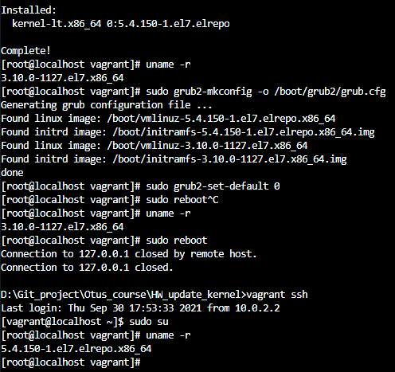

# `З чого поинається Linx`

Навчки роботи з Git, Vagrant, Packer та публікації готових образів у Vagrant Cloud

## `Завдання`

### `Оновити ядро базової системи`

В матеріалах до заняття є методичка, в якій описана процедура оновлення ядра з репозиторію

По даній методичці потрібно виконати оновлення ядра

Отриманий після виконання завдання Vagrantfile потрібно завантажити у ваш репозиторий у Vagrant Cloud

### `Додаткові завдання`

1. Ядро зібране із "sources"

2. В образі нормально працюють "VirtualBox Shared Folders"

### `Вирішення`

<details><summary>CentOS 7</summary><blockquote>

Створив ВМ:

```ruby
# -*- mode: ruby -*-
# vim: set ft=ruby :

ENV["LC_ALL"] = "en_US.UTF-8"

Vagrant.configure("2") do |config|
  # Вибір боксу
  config.vm.box = "centos/7"
  config.vm.box_check_update = false
  config.vm.hostname = "01-upd-kernel"

  # ім'я в `vagrant global-status`
  config.vm.define "CO7_custom"

  config.vm.provider "virtualbox" do |v|
    # ім'я в VirtualBox
    v.name = "CO7_custom"
    v.gui = false
    v.memory = 1024
    v.cpus = 2
  end

  # Встановлення нового ядра
  config.vm.provision "shell", type: "shell", inline: <<-SHELL
    sudo yum install -y https://www.elrepo.org/elrepo-release-7.el7.elrepo.noarch.rpm
    sudo yum -y --enablerepo elrepo-kernel install kernel-lt
    sudo grub2-mkconfig -o /boot/grub2/grub.cfg
    sudo grub2-set-default 0
    sudo reboot
  SHELL

end
```

Після ребута перевірив роботоспроможність з новим ядром



После цього створив Vagrant box з допомогою `vagrant package` та завантажив його на Vagrant Cloud

Роботоспроможність можна перевірити запустивши Vagrantfile:

```ruby
Vagrant.configure("2") do |config|
  config.vm.box = "Conflict/CO7_custom"
  config.vm.box_version = "0.0.1"
end
```

## Корисні посилання

<https://phoenixnap.com/kb/how-to-upgrade-kernel-centos>

<http://elrepo.org/tiki/kernel-lt>
</blockquote></details>

<details><summary> Debian 11 `bullseye`</summary><blockquote>

Показаний нижче Vagrantfile створює  віртуальну машину на базі Debian 11 `bullseye64` (який має ядро linux-image-5.10.0-23-amd64)
Далі відбувається оновлення системи, встановлення ядра linux-image-6.1.0-0.deb11.7-amd64 та перезавнтаження ВМ

```ruby
# -*- mode: ruby -*-
# vim: set ft=ruby :

ENV["LC_ALL"] = "en_US.UTF-8"

Vagrant.configure("2") do |config|
  # Вибір боксу
  config.vm.box = "debian/bullseye64"
  config.vm.box_check_update = false
  config.vm.hostname = "01-upd-kernel"
  
  # ім'я в `vagrant global-status`
  config.vm.define "Deb-Update-kernel"

  config.vm.provider "virtualbox" do |v|
    # ім'я в `VirtualBox`
    v.name = "Deb-Update-kernel" 
    v.gui = false
    v.memory = 1024
    v.cpus = 2
  end

  config.vm.provision "shell", type: "shell", inline: <<-SHELL
    sudo apt-get update -yy
    sudo apt-get install linux-image-6.1.0-0.deb11.7-amd64 -yy
    sudo reboot
  SHELL

end
```

Роботоспроможність можна перевірити запустивши Vagrantfile:

```ruby
Vagrant.configure("2") do |config|
  config.vm.box = "Conflict/Debian11"
  config.vm.box_version = "1.0.0"
end
```

## Корисні посилання

<https://www.libe.net/en-debian-kernel-update>

<https://habr.com/ru/articles/736478/>

</blockquote></details>

### `Створення Vagrant box`

```bash
# Видалення пустого місця для зменшення розміру готового Box`a
sudo dd if=/dev/zero of=/EMPTY bs=1M
sudo rm -f /EMPTY

# Створення Box`a з існуючої ВМ 
vagrant package
```

### Корисні посилання

<details><summary>Розгорнути</summary>

<https://www.engineyard.com/blog/building-a-vagrant-box-from-start-to-finish/>

</details>
